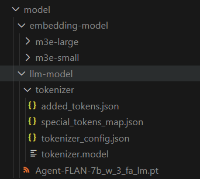

# paper_helper

an assistant based on ryzenai for paper reading

## 项目介绍

本项目使用AMD AI PC，使用Agent-FLAN-7b模型和Llamaindex，在本地搭建了一个RAG系统，能够辅助用户阅读论文等文档，提高用户的科研工作效率。

## 环境搭建
程序运行基于conda环境，具体搭建步骤可以参考RyzenAI-SW中的[example/transformers](https://github.com/amd/RyzenAI-SW/tree/main/example/transformers)，并且要添加llamaindex和streamlit等必要的库。

程序必须使用CMD环境运行，否则环境变量设置会不起作用，造成程序运行出错。

进入虚拟环境并设置环境变量
```
conda activate ryzenai-transformers
setup_local.bat
```

## 模型介绍

本项目使用到的模型为[internlm/Agent-FLAN-7b](https://huggingface.co/internlm/Agent-FLAN-7b)，该模型基于Lamma2-7b，在Agent-FLAN dataset数据集上训练而来。具有较强的agent能力。

## 使用说明

本项目主要包含模型量化和模型推理两部分。

### 模型转换

首先需要从[huggingface](https://huggingface.co/datasets/mit-han-lab/awq-model-zoo)上将要转换模型的AWQ Model放入到model_quant/model_quant/awq_cache目录下

具体细节请参考model_quant目录下的README文件。

### 模型推理

首先在项目中新建model目录，将量化生成的模型文件、tokenizer以及enbedding模型按照如下结构放入其中：



Then, you need a LlamaCloud API key. You can get one for free by signing up for [LlamaCloud](https://cloud.llamaindex.ai/). Then put it in your config.ini file just like your OpenAI key:
```
[llamma]
api_key = llx-xxxxxxxxx
```

最后运行web_demo.py文件
```
streamlit run web_demo.py
```

